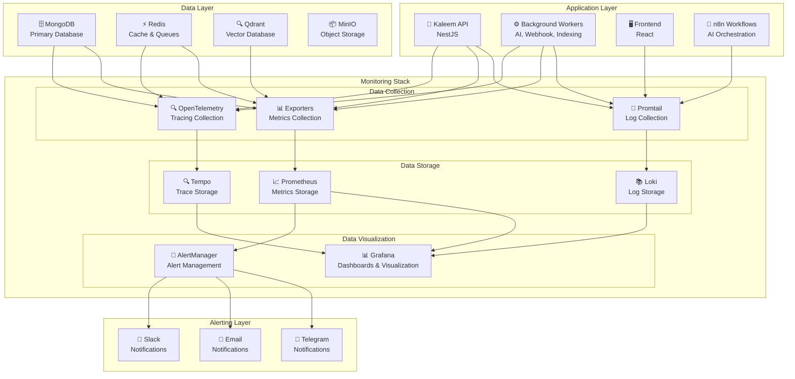

# مخطط مكدس المراقبة الشامل

## 🏗️ مخطط مكدس المراقبة الشامل



## 📋 وصف مكدس المراقبة

### طبقة التطبيق (Application Layer)

- **Kaleem API**: التطبيق الرئيسي
- **Background Workers**: العمال في الخلفية
- **Frontend**: الواجهة الأمامية
- **n8n Workflows**: سير عمل الذكاء الاصطناعي

### طبقة البيانات (Data Layer)

- **MongoDB**: قاعدة البيانات الرئيسية
- **Redis**: التخزين المؤقت والطوابير
- **Qdrant**: قاعدة بيانات المتجهات
- **MinIO**: تخزين الكائنات

### طبقة المراقبة (Monitoring Stack)

#### جمع البيانات (Data Collection)

- **Promtail**: جمع السجلات
- **Exporters**: جمع المقاييس
- **OpenTelemetry**: جمع الآثار

#### تخزين البيانات (Data Storage)

- **Loki**: تخزين السجلات
- **Prometheus**: تخزين المقاييس
- **Tempo**: تخزين الآثار

#### عرض البيانات (Data Visualization)

- **Grafana**: لوحات ورسوم بيانية
- **AlertManager**: إدارة التنبيهات

### طبقة التنبيهات (Alerting Layer)

- **Telegram**: تنبيهات فورية
- **Email**: تنبيهات عبر البريد
- **Slack**: تنبيهات عبر Slack

## 🔧 تكوين الخدمات

### تكوين Promtail

```yaml
server:
  http_listen_port: 9080

clients:
  - url: http://loki:3100/loki/api/v1/push

scrape_configs:
  - job_name: docker-logs
    docker_sd_configs:
      - host: unix:///var/run/docker.sock
        refresh_interval: 10s
```

### تكوين Prometheus

```yaml
global:
  scrape_interval: 15s
  evaluation_interval: 15s

scrape_configs:
  - job_name: "api"
    static_configs:
      - targets: ["kaleem-api:3000"]
```

### تكوين Grafana

```yaml
datasources:
  - name: Prometheus
    type: prometheus
    url: http://prometheus:9090
  - name: Loki
    type: loki
    url: http://loki:3100
  - name: Tempo
    type: tempo
    url: http://tempo:3200
```

## 📊 لوحات المراقبة

### لوحة النظام العامة

- **CPU Usage**: استخدام المعالج
- **Memory Usage**: استخدام الذاكرة
- **Disk Usage**: استخدام القرص
- **Network Traffic**: حركة الشبكة

### لوحة التطبيق

- **Request Rate**: معدل الطلبات
- **Response Time**: وقت الاستجابة
- **Error Rate**: معدل الأخطاء
- **Business Metrics**: مقاييس الأعمال

### لوحة قاعدة البيانات

- **Connection Pool**: تجمع الاتصالات
- **Query Performance**: أداء الاستعلامات
- **Cache Hit Rate**: معدل نجاح التخزين المؤقت
- **Storage Usage**: استخدام التخزين

### لوحة الذكاء الاصطناعي

- **Embedding Generation**: توليد الـ embeddings
- **Vector Search**: البحث في المتجهات
- **AI Response Time**: وقت استجابة الذكاء الاصطناعي
- **Model Performance**: أداء النماذج

## 🚨 قواعد التنبيه

### تنبيهات حرجة (Critical Alerts)

```yaml
- alert: ServiceDown
  expr: up{job="api"} == 0
  for: 1m
  labels:
    severity: critical
  annotations:
    summary: "Service is down"
    description: "API service is not responding"
```

### تنبيهات تحذيرية (Warning Alerts)

```yaml
- alert: HighCPUUsage
  expr: rate(container_cpu_usage_seconds_total[5m]) > 0.8
  for: 5m
  labels:
    severity: warning
  annotations:
    summary: "High CPU usage"
    description: "CPU usage is above 80%"
```

### تنبيهات معلوماتية (Info Alerts)

```yaml
- alert: ServiceRestart
  expr: changes(container_start_time_seconds[5m]) > 0
  for: 0m
  labels:
    severity: info
  annotations:
    summary: "Service restarted"
    description: "Service has been restarted"
```

## 🔗 الروابط والوصول (مُطبق فعلياً)

| الخدمة       | الرابط الفعلي                 | الوصف                  | الحالة |
| ------------ | ------------------------------ | ---------------------- | ------ |
| Grafana      | `https://grafana.kaleem-ai.com` | لوحة المراقبة الرئيسية | ✅ مُفعل |
| Prometheus   | `http://localhost:9090`         | واجهة Prometheus       | ✅ مُفعل |
| Loki         | `http://localhost:3100`         | واجهة Loki             | ✅ مُفعل |
| Tempo        | `http://localhost:3200`         | واجهة Tempo            | ✅ مُفعل |
| AlertManager | `http://localhost:9093`         | إدارة التنبيهات        | ✅ مُفعل |
| N8N         | `https://n8n.kaleem-ai.com`     | سير عمل AI             | ✅ مُفعل |
| Redis Commander | `http://localhost:8082`       | إدارة Redis             | ✅ مُفعل |
| Mongo Express | `http://localhost:8081`        | إدارة MongoDB           | ✅ مُفعل |

### اللوحات المُطبقة فعلياً

#### 1. API Health Dashboard
**الموقع**: Grafana → Dashboards → API Health
**المقاييس**:
- Request Rate (RPS) حسب المسار والطريقة
- Error Rate (5xx %) مع فلترة
- Latency p95 (s) حسب المسار
- DB Query p95 (s) حسب العملية
- Cache Hit Rate (%)
- WS Active Connections

#### 2. Business KPIs Dashboard
**الموقع**: Grafana → Dashboards → Business KPIs
**المقاييس**:
- Merchants Created (معدل/5دقائق)
- n8n Workflows Created (معدل/5دقائق)
- Products Created/Updated/Deleted
- Active Merchants
- Email Verification Success/Failure
- Password Changes

## 📈 مقاييس الأداء

### مقاييس النظام

- **CPU Usage**: < 80%
- **Memory Usage**: < 80%
- **Disk Usage**: < 90%
- **Network Latency**: < 100ms

### مقاييس التطبيق

- **Response Time**: < 500ms (95th percentile)
- **Error Rate**: < 0.1%
- **Throughput**: > 1000 req/min
- **Availability**: > 99.9%

### مقاييس قاعدة البيانات

- **Query Time**: < 100ms (95th percentile)
- **Connection Pool**: < 80% utilization
- **Cache Hit Rate**: > 90%
- **Index Usage**: > 95%
