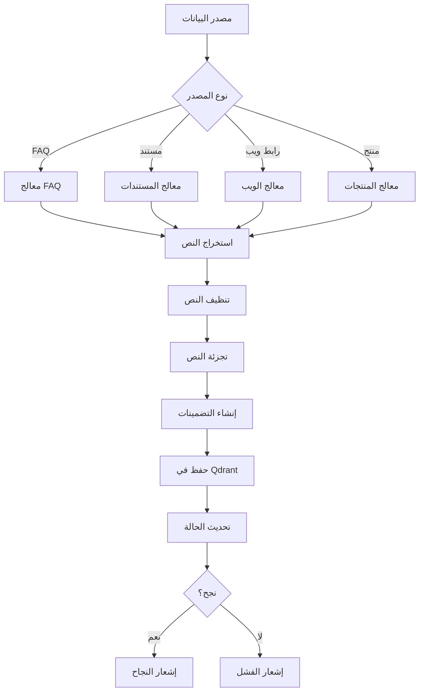

# وثيقة خطوط بيانات الذكاء الاصطناعي/RAG

## نظام Kaleem AI - الاسترجاع المعزز بالتوليد (Retrieval-Augmented Generation)

---

## جدول المحتويات

1. [نظرة عامة على نظام RAG](#نظرة-عامة-على-نظام-rag)
2. [مصادر المعرفة وجمع البيانات](#مصادر-المعرفة-وجمع-البيانات)
3. [خط معالجة البيانات](#خط-معالجة-البيانات)
4. [استراتيجية التجزئة والتضمين](#استراتيجية-التجزئة-والتضمين)
5. [نظام تخزين المتجهات](#نظام-تخزين-المتجهات)
6. [عملية البحث والاسترجاع](#عملية-البحث-والاسترجاع)
7. [نظام إعادة الترتيب](#نظام-إعادة-الترتيب)
8. [حدود الحجم والأداء](#حدود-الحجم-والأداء)
9. [استراتيجية التحديث وإعادة الفهرسة](#استراتيجية-التحديث-وإعادة-الفهرسة)
10. [المراقبة والصيانة](#المراقبة-والصيانة)
11. [التوصيات والتحسينات](#التوصيات-والتحسينات)

---

## نظرة عامة على نظام RAG

نظام **Kaleem AI** يستخدم بنية **RAG (Retrieval-Augmented Generation)** متقدمة لتوفير إجابات ذكية ودقيقة للعملاء. يجمع النظام بين قوة البحث الدلالي والذكاء الاصطناعي التوليدي.

### البنية العامة

```
┌─────────────────┐    ┌─────────────────┐    ┌─────────────────┐
│  مصادر المعرفة  │────│  معالج البيانات  │────│  قاعدة المتجهات │
│  (Knowledge)    │    │  (Processing)   │    │   (Qdrant)      │
└─────────────────┘    └─────────────────┘    └─────────────────┘
         │                       │                       │
         ▼                       ▼                       ▼
┌─────────────────┐    ┌─────────────────┐    ┌─────────────────┐
│  استخراج النص   │────│  تجزئة وتضمين   │────│  فهرسة وتخزين   │
│  (Extraction)   │    │  (Chunking)     │    │   (Indexing)    │
└─────────────────┘    └─────────────────┘    └─────────────────┘
                                │
                                ▼
                    ┌─────────────────┐
                    │  البحث والاسترجاع │
                    │   (Retrieval)   │
                    └─────────────────┘
                                │
                                ▼
                    ┌─────────────────┐
                    │  إعادة الترتيب   │
                    │   (Reranking)   │
                    └─────────────────┘
                                │
                                ▼
                    ┌─────────────────┐
                    │  التوليد النهائي │
                    │  (Generation)   │
                    └─────────────────┘
```

### المكونات الأساسية

1. **خدمة التضمين (Embedding Service)**: نموذج `paraphrase-multilingual-MiniLM-L12-v2`
2. **قاعدة المتجهات (Qdrant)**: تخزين وبحث المتجهات
3. **خدمة الاستخراج (Extractor Service)**: استخراج النصوص من المصادر
4. **نظام إعادة الترتيب (Gemini Rerank)**: تحسين ترتيب النتائج
5. **ذاكرة المحادثة (Chat Memory)**: سياق المحادثات

---

## مصادر المعرفة وجمع البيانات

### 1. مصادر المعرفة الأساسية

#### **أ. الأسئلة الشائعة (FAQs)**

```typescript
// مصادر FAQ
{
  merchants: 'أسئلة خاصة بكل تاجر',
  bot_faqs: 'أسئلة عامة لنظام كليم',
  system: 'أسئلة النظام والدعم الفني'
}

// عملية المعالجة
const processFAQ = async (faq) => {
  const text = `${faq.question}\n${faq.answer}`;
  const embedding = await vectorService.embed(text);
  await vectorService.upsertFaqs([{
    id: generateFaqId(faq.id),
    vector: embedding,
    payload: {
      merchantId,
      faqId: faq.id,
      question: faq.question,
      answer: faq.answer,
      type: 'faq',
      source: 'manual'
    }
  }]);
};
```

#### **ب. المستندات (Documents)**

**أنواع المستندات المدعومة:**

- PDF (`.pdf`)
- Word Documents (`.docx`)
- Excel Spreadsheets (`.xlsx`, `.xls`)
- Text Files (`.txt`)

```typescript
// معالجة المستندات
const supportedTypes = {
  'application/pdf': extractFromPDF,
  'application/vnd.openxmlformats-officedocument.wordprocessingml.document':
    extractFromWord,
  'application/vnd.openxmlformats-officedocument.spreadsheetml.sheet':
    extractFromExcel,
  'application/vnd.ms-excel': extractFromExcel,
};

// خط المعالجة
async function processDocument(docId: string) {
  // 1. تحميل المستند من MinIO
  const filePath = await downloadFromMinioToTemp(minio, doc.storageKey);

  // 2. استخراج النص حسب النوع
  let text = '';
  if (doc.fileType === 'application/pdf') {
    const buffer = readFileSync(filePath);
    const parsed = await pdfParse(buffer);
    text = parsed.text;
  } else if (doc.fileType.includes('wordprocessingml')) {
    const result = await mammoth.extractRawText({ path: filePath });
    text = result.value;
  }

  // 3. تجزئة النص
  const maxChunkSize = 500;
  const chunks = text.match(new RegExp(`.{1,${maxChunkSize}}`, 'gs')) ?? [];

  // 4. إنشاء التضمينات وحفظها
  for (let i = 0; i < chunks.length; i++) {
    const embedding = await vectorService.embed(chunks[i]);
    await vectorService.upsertDocumentChunks([
      {
        id: `${docId}-${i}`,
        vector: embedding,
        payload: {
          merchantId: doc.merchantId,
          documentId: docId,
          text: chunks[i].substring(0, 2000),
          chunkIndex: i,
          totalChunks: chunks.length,
        },
      },
    ]);
  }
}
```

#### **ج. المحتوى الويب (Web Content)**

```typescript
// معالجة روابط الويب
async function processWebUrl(url: string, merchantId: string) {
  // 1. استخراج النص من الرابط
  const { text } = await extractTextFromUrl(url);

  // 2. تجزئة النص
  const chunks = (text.match(/.{1,1000}/gs) ?? []).map((s) => s.trim());

  // 3. فلترة القطع المفيدة
  const processedChunks = chunks.filter((chunk) => {
    if (chunk.length < 30) return false;
    return isUsefulChunk(chunk); // فحص المحتوى العربي
  });

  // 4. إنشاء التضمينات
  for (let i = 0; i < processedChunks.length; i++) {
    const embedding = await vectorService.embed(processedChunks[i]);
    await vectorService.upsertWebKnowledge([
      {
        id: generateWebKnowledgeId(merchantId, `${url}#${i}`),
        vector: embedding,
        payload: {
          merchantId,
          url,
          text: processedChunks[i],
          type: 'url',
          source: 'web',
        },
      },
    ]);
  }
}

// فحص المحتوى المفيد
function isUsefulChunk(text: string): boolean {
  const arabicCount = (text.match(/[\u0600-\u06FF]/g) || []).length;
  return arabicCount >= 3; // على الأقل 3 أحرف عربية
}
```

#### **د. بيانات المنتجات (Products)**

```typescript
// معالجة بيانات المنتجات
async function indexProduct(product: EmbeddableProduct) {
  // 1. تجميع النص الوصفي
  const textParts = [
    product.name,
    product.description,
    product.category,
    ...(product.keywords || []),
    product.price ? `السعر: ${product.price}` : '',
    product.isAvailable ? 'متوفر' : 'غير متوفر',
  ].filter(Boolean);

  const combinedText = textParts.join(' ');

  // 2. إنشاء التضمين
  const embedding = await embed(combinedText);

  // 3. حفظ في قاعدة المتجهات
  await qdrant.upsert(collection, {
    points: [
      {
        id: qdrantIdFor(product.mongoId),
        vector: embedding,
        payload: {
          merchantId: product.merchantId,
          mongoId: product.mongoId,
          name: product.name,
          price: product.price,
          isAvailable: product.isAvailable,
          category: product.category,
          url: product.url,
        },
      },
    ],
  });
}
```

### 2. خدمة الاستخراج (Extractor Service)

**خدمة Python متخصصة لاستخراج بيانات المنتجات من المواقع:**

```python
# extractor-service/app/extractor.py
def full_extract(url: str):
    html = fetch_html(url)
    soup = BeautifulSoup(html, "html.parser")

    # 1. استخراج البيانات المنظمة (JSON-LD)
    prod = extract_structured(html)
    if prod:
        return prod

    # 2. استخراج من Meta Tags
    meta = extract_meta(soup)
    if meta["name"] or meta["price"]:
        return meta

    # 3. استخراج باستخدام Regex
    text = soup.get_text(" ")
    price = regex_extract_price(text)
    availability = regex_extract_availability(text)

    # 4. استخراج ديناميكي باستخدام Playwright
    return extract_dynamic_with_playwright(url)
```

---

## خط معالجة البيانات

### 1. خط المعالجة العام



### 2. معالجة غير متزامنة

```typescript
// نظام الطوابير (Queue System)
@Processor('documents-processing-queue')
export class DocumentProcessor {
  @Process('process')
  async process(job: Job<DocumentJobData>): Promise<void> {
    const { docId, merchantId } = job.data;

    try {
      // معالجة المستند
      await this.processDocument(docId);

      // تحديث الحالة
      await this.docModel.findByIdAndUpdate(docId, {
        status: 'completed',
      });

      // إرسال إشعار
      await this.notifyCompletion(merchantId, docId);
    } catch (error) {
      // تسجيل الخطأ وتحديث الحالة
      await this.docModel.findByIdAndUpdate(docId, {
        status: 'failed',
        errorMessage: error.message,
      });

      throw error;
    }
  }
}
```

### 3. نظام الأحداث (Event-Driven)

```typescript
// إرسال أحداث المعالجة
await this.outbox.enqueueEvent({
  exchange: 'knowledge.index',
  routingKey: 'document.started',
  eventType: 'knowledge.document.started',
  aggregateType: 'knowledge',
  aggregateId: merchantId,
  payload: { merchantId, documentId, status: 'processing' }
});

// استقبال ومعالجة الأحداث
@EventPattern('knowledge.document.completed')
async handleDocumentCompleted(data: any) {
  await this.updateSearchIndex(data.merchantId);
  await this.notifyUser(data.userId, 'تم فهرسة المستند بنجاح');
}
```

---

## استراتيجية التجزئة والتضمين

### 1. استراتيجيات التجزئة

#### **أ. تجزئة المستندات**

```typescript
// استراتيجية التجزئة الثابتة
const maxChunkSize = 500; // أحرف
const chunks = text.match(new RegExp(`.{1,${maxChunkSize}}`, 'gs')) ?? [];

// استراتيجية التجزئة الذكية (مقترحة)
function smartChunking(text: string, maxSize: number = 500): string[] {
  const sentences = text.split(/[.!?؟]\s+/);
  const chunks: string[] = [];
  let currentChunk = '';

  for (const sentence of sentences) {
    if ((currentChunk + sentence).length <= maxSize) {
      currentChunk += sentence + '. ';
    } else {
      if (currentChunk) chunks.push(currentChunk.trim());
      currentChunk = sentence + '. ';
    }
  }

  if (currentChunk) chunks.push(currentChunk.trim());
  return chunks;
}
```

#### **ب. تجزئة المحتوى الويب**

```typescript
// تجزئة محتوى الويب
const webChunkSize = 1000; // أحرف أكثر للمحتوى الويب
const chunks = (text.match(/.{1,1000}/gs) ?? [])
  .map((s) => s.trim())
  .filter((chunk) => {
    // فلترة القطع القصيرة
    if (chunk.length < 30) return false;

    // فلترة المحتوى غير المفيد
    return isUsefulChunk(chunk);
  });
```

#### **ج. تجزئة الأسئلة الشائعة**

```typescript
// الأسئلة الشائعة لا تحتاج تجزئة
const faqText = `${faq.question}\n${faq.answer}`;
const embedding = await vectorService.embed(faqText);
```

### 2. نظام التضمين (Embedding System)

#### **أ. خدمة التضمين**

```python
# embedding-service/main.py
from sentence_transformers import SentenceTransformer

# نموذج متعدد اللغات محسن للعربية
model_name = "paraphrase-multilingual-MiniLM-L12-v2"
model = SentenceTransformer(model_name)

@app.post("/embed")
def embed(req: EmbeddingRequest):
    if not req.texts:
        raise HTTPException(status_code=400, detail="No texts provided.")

    # إنشاء التضمينات
    embeddings = model.encode(req.texts, show_progress_bar=False).tolist()
    return EmbeddingResponse(embeddings=embeddings)
```

#### **ب. استدعاء خدمة التضمين**

```typescript
// vector.service.ts
public async embed(text: string): Promise<number[]> {
  try {
    const response = await firstValueFrom(
      this.http.post<{ embeddings: number[][] }>(`${this.embeddingBase}/embed`, {
        texts: [text]
      })
    );

    const embedding = response.data.embeddings[0];

    // التحقق من صحة المتجه (384 بُعد)
    if (!embedding || embedding.length !== 384) {
      throw new Error(`Invalid embedding length: ${embedding.length}`);
    }

    return embedding;
  } catch (error) {
    throw new Error(`Embedding failed: ${error.message}`);
  }
}
```

### 3. معايير جودة التضمين

```typescript
// فحص جودة النص قبل التضمين
function validateTextQuality(text: string): boolean {
  // طول النص
  if (text.length < 10 || text.length > 2000) return false;

  // محتوى عربي كافي
  const arabicRatio =
    (text.match(/[\u0600-\u06FF]/g) || []).length / text.length;
  if (arabicRatio < 0.1) return false; // على الأقل 10% عربي

  // تجنب النصوص المكررة
  const uniqueWords = new Set(text.split(/\s+/)).size;
  const totalWords = text.split(/\s+/).length;
  if (uniqueWords / totalWords < 0.3) return false; // تنوع 30% على الأقل

  return true;
}
```

---

## نظام تخزين المتجهات

### 1. بنية Qdrant

```typescript
// مجموعات البيانات في Qdrant
const collections = {
  products: 'منتجات التجار',
  faqs: 'أسئلة شائعة للتجار',
  bot_faqs: 'أسئلة شائعة لكليم',
  documents: 'مستندات التجار',
  web_knowledge: 'محتوى الويب',
  offers: 'العروض والخصومات'
};

// إعداد المجموعة
async onModuleInit() {
  await this.qdrant.createCollection(this.faqCollection, {
    vectors: {
      size: 384, // حجم المتجه
      distance: 'Cosine' // مقياس المسافة
    }
  });
}
```

### 2. عمليات التخزين

#### **أ. إدراج البيانات (Upsert)**

```typescript
// إدراج نقاط متعددة
public async upsertFaqs(points: FaqPoint[]): Promise<void> {
  const validPoints = points.filter(p =>
    Array.isArray(p.vector) && p.vector.length === 384
  );

  if (!validPoints.length) {
    throw new Error('No valid points to upsert!');
  }

  // معالجة دفعية لتحسين الأداء
  const batchSize = 100;
  for (let i = 0; i < validPoints.length; i += batchSize) {
    const batch = validPoints.slice(i, i + batchSize);
    await this.qdrant.upsert(this.faqCollection, {
      wait: true,
      points: batch
    });
  }
}
```

#### **ب. حذف البيانات**

```typescript
// حذف نقطة واحدة
async deleteFaqPoint(pointId: string) {
  return this.qdrant.delete(this.faqCollection, {
    points: [pointId]
  });
}

// حذف بناء على فلتر
async deleteByMerchant(merchantId: string) {
  return this.qdrant.delete(this.faqCollection, {
    filter: {
      must: [{ key: 'merchantId', match: { value: merchantId } }]
    }
  });
}
```

### 3. فهرسة وتحسين الأداء

```typescript
// إنشاء فهارس للبحث السريع
await this.qdrant.createPayloadIndex(this.faqCollection, {
  field_name: 'merchantId',
  field_schema: 'keyword',
});

await this.qdrant.createPayloadIndex(this.faqCollection, {
  field_name: 'type',
  field_schema: 'keyword',
});

// تحسين ذاكرة التخزين
await this.qdrant.updateCollection(this.faqCollection, {
  optimizers_config: {
    default_segment_number: 2,
    max_segment_size: 100000,
    memmap_threshold: 50000,
  },
});
```

---

## عملية البحث والاسترجاع

### 1. البحث الموحد (Unified Search)

```typescript
// البحث في جميع مصادر المعرفة
public async unifiedSemanticSearch(
  text: string,
  merchantId: string,
  topK = 5
): Promise<SearchResult[]> {

  // 1. إنشاء متجه البحث
  const vector = await this.embed(text);
  const allResults: SearchResult[] = [];

  // 2. البحث في جميع المجموعات
  const searchTargets = [
    { name: this.faqCollection, type: 'faq' },
    { name: this.documentCollection, type: 'document' },
    { name: this.webCollection, type: 'web' }
  ];

  // 3. تنفيذ البحث المتوازي
  await Promise.all(
    searchTargets.map(async (target) => {
      try {
        const results = await this.qdrant.search(target.name, {
          vector,
          limit: topK * 2, // جلب أكثر للفلترة
          with_payload: true,
          filter: {
            must: [{ key: 'merchantId', match: { value: merchantId } }]
          }
        });

        // إضافة النتائج مع النوع
        for (const item of results) {
          allResults.push({
            type: target.type,
            score: item.score,
            data: item.payload,
            id: item.id
          });
        }
      } catch (err) {
        this.logger.warn(`Search failed for ${target.name}: ${err.message}`);
      }
    })
  );

  if (allResults.length === 0) return [];

  // 4. إعادة ترتيب النتائج
  const candidates = allResults.map((r) => {
    if (r.type === 'faq') {
      return `${r.data.question} - ${r.data.answer}`;
    }
    return r.data.text || '';
  });

  const rerankedIndexes = await geminiRerankTopN({
    query: text,
    candidates,
    topN: topK
  });

  return rerankedIndexes.map(idx => allResults[idx]);
}
```

### 2. البحث في المنتجات

```typescript
// البحث المتقدم في المنتجات
public async querySimilarProducts(
  text: string,
  merchantId: string,
  topK = 5
) {
  // 1. البحث الدلالي
  const vector = await this.embed(text);
  const rawResults = await this.qdrant.search(this.collection, {
    vector,
    limit: topK * 4,
    with_payload: true,
    filter: {
      must: [{ key: 'merchantId', match: { value: merchantId } }]
    }
  });

  if (!rawResults.length) return [];

  // 2. تحضير المرشحين لإعادة الترتيب
  const candidates = rawResults.map((item) => {
    const p = item.payload;
    return `اسم المنتج: ${p.name}${p.price ? ` - السعر: ${p.price}` : ''}`;
  });

  // 3. إعادة ترتيب بواسطة Gemini
  let rerankedIdx: number[] = [];
  try {
    rerankedIdx = await geminiRerankTopN({
      query: text,
      candidates,
      topN: topK
    });
  } catch (error) {
    // استخدام الترتيب الأصلي عند الفشل
    rerankedIdx = Array.from({ length: Math.min(topK, rawResults.length) }, (_, i) => i);
  }

  // 4. إرجاع النتائج المرتبة
  return rerankedIdx.map(i => ({
    ...rawResults[i].payload,
    score: rawResults[i].score,
    url: this.resolveProductUrl(rawResults[i].payload)
  }));
}
```

### 3. فلترة وتحسين النتائج

```typescript
// فلترة النتائج حسب الجودة
function filterResultsByQuality(
  results: SearchResult[],
  minScore = 0.7,
): SearchResult[] {
  return results
    .filter((result) => result.score >= minScore)
    .sort((a, b) => b.score - a.score);
}

// تنويع النتائج (Diversity)
function diversifyResults(
  results: SearchResult[],
  maxPerType = 2,
): SearchResult[] {
  const diversified: SearchResult[] = [];
  const typeCounts: Record<string, number> = {};

  for (const result of results) {
    const count = typeCounts[result.type] || 0;
    if (count < maxPerType) {
      diversified.push(result);
      typeCounts[result.type] = count + 1;
    }
  }

  return diversified;
}
```

---

## نظام إعادة الترتيب

### 1. إعادة الترتيب بـ Gemini

```typescript
// geminiRerank.ts
export async function geminiRerankTopN({
  query,
  candidates,
  topN = 5,
}: {
  query: string;
  candidates: string[];
  topN?: number;
}): Promise<number[]> {
  const GEMINI_API_KEY = process.env.GEMINI_API_KEY;
  if (!GEMINI_API_KEY) throw new Error('Missing GEMINI_API_KEY');

  // تنظيف وتحضير المرشحين
  const validCandidates = candidates
    .filter(Boolean)
    .map((c) => c.slice(0, 300)); // تحديد الطول لتوفير التوكنز

  if (validCandidates.length === 0) {
    throw new Error('No valid candidates!');
  }

  // إعداد البرومبت
  const prompt = `
  السؤال: "${query}"
  هذه قائمة المنتجات أو الإجابات:
  ${candidates.map((c, i) => `(${i + 1}): ${c}`).join('\n')}
  اختر لي أفضل ${topN} إجابات أو منتجات الأكثر صلة بالسؤال.  
  أعطني أرقامهم مفصولة بفواصل (مثال: 2,5,7).  
  إذا لا يوجد جواب دقيق أكتب "لا يوجد جواب دقيق".
  `;

  // استدعاء Gemini API
  const body = {
    contents: [{ role: 'user', parts: [{ text: prompt }] }],
    generationConfig: {
      maxOutputTokens: 40,
      temperature: 0.1, // دقة عالية
    },
  };

  try {
    const { data } = await axios.post(
      'https://generativelanguage.googleapis.com/v1beta/models/gemini-2.0-flash:generateContent?key=' +
        GEMINI_API_KEY,
      body,
    );

    const text = data.candidates?.[0]?.content?.parts?.[0]?.text ?? '';

    // فحص عدم وجود جواب
    if (text.includes('لا يوجد جواب')) return [];

    // استخراج الأرقام وتحويلها لفهارس
    const nums = text.match(/\d+/g)?.map(Number) ?? [];
    const indexes = nums
      .map((n) => n - 1) // تحويل إلى 0-based indexing
      .filter((n) => n >= 0 && n < candidates.length);

    return indexes;
  } catch (error: any) {
    console.error('Gemini API Error:', error.response?.data || error.message);
    throw new Error(error.response?.data?.error?.message || error.message);
  }
}
```

### 2. استراتيجيات إعادة الترتيب المتعددة

```typescript
// نظام إعادة ترتيب هجين
class HybridRerankingSystem {
  // إعادة ترتيب بناء على النقاط
  async scoreBasedRerank(
    results: SearchResult[],
    query: string,
  ): Promise<SearchResult[]> {
    return results
      .map((result) => ({
        ...result,
        adjustedScore: this.calculateAdjustedScore(result, query),
      }))
      .sort((a, b) => b.adjustedScore - a.adjustedScore);
  }

  // حساب النقاط المعدلة
  private calculateAdjustedScore(result: SearchResult, query: string): number {
    let score = result.score;

    // تعزيز نتائج FAQ
    if (result.type === 'faq') score *= 1.2;

    // تعزيز النتائج الحديثة
    const ageBoost = this.calculateAgeBoost(result.data.createdAt);
    score *= ageBoost;

    // تعزيز التطابق الدقيق
    const exactMatchBoost = this.calculateExactMatchBoost(
      result.data.text,
      query,
    );
    score *= exactMatchBoost;

    return score;
  }

  // تعزيز العمر
  private calculateAgeBoost(createdAt: Date): number {
    const now = new Date();
    const ageInDays =
      (now.getTime() - createdAt.getTime()) / (1000 * 60 * 60 * 24);

    if (ageInDays <= 30) return 1.1; // محتوى جديد
    if (ageInDays <= 90) return 1.0; // محتوى متوسط
    return 0.9; // محتوى قديم
  }

  // تعزيز التطابق الدقيق
  private calculateExactMatchBoost(text: string, query: string): number {
    const queryWords = query.toLowerCase().split(/\s+/);
    const textWords = text.toLowerCase().split(/\s+/);

    const matchCount = queryWords.filter((word) =>
      textWords.some((textWord) => textWord.includes(word)),
    ).length;

    return 1 + (matchCount / queryWords.length) * 0.2;
  }
}
```

---

## حدود الحجم والأداء

### 1. حدود النصوص والتجزئة

```typescript
// حدود النصوص
const TEXT_LIMITS = {
  // حدود التجزئة
  CHUNK_SIZE: {
    documents: 500, // أحرف للمستندات
    web_content: 1000, // أحرف للمحتوى الويب
    faq: 2000, // أحرف للأسئلة الشائعة
    products: 1000, // أحرف للمنتجات
  },

  // حدود النص الكامل
  MAX_TEXT_LENGTH: {
    document: 1000000, // 1MB للمستند الواحد
    web_page: 500000, // 500KB للصفحة الواحدة
    faq_answer: 5000, // 5KB للجواب الواحد
    product_desc: 2000, // 2KB لوصف المنتج
  },

  // حدود البحث
  SEARCH_LIMITS: {
    max_results: 50, // أقصى نتائج أولية
    rerank_candidates: 20, // مرشحين لإعادة الترتيب
    final_results: 5, // النتائج النهائية
  },
};

// تطبيق الحدود
function enforceTextLimits(text: string, type: string): string {
  const limit = TEXT_LIMITS.MAX_TEXT_LENGTH[type];
  if (text.length > limit) {
    return text.substring(0, limit) + '...';
  }
  return text;
}
```

### 2. حدود الذاكرة والمعالجة

```typescript
// إعدادات الأداء
const PERFORMANCE_CONFIG = {
  // معالجة دفعية
  BATCH_SIZES: {
    embedding: 10, // عدد النصوص للتضمين في الدفعة
    qdrant_upsert: 100, // عدد النقاط للإدراج في الدفعة
    document_chunks: 50, // عدد القطع للمعالجة في الدفعة
  },

  // مهلات زمنية
  TIMEOUTS: {
    embedding: 30000, // 30 ثانية للتضمين
    qdrant_search: 10000, // 10 ثواني للبحث
    reranking: 15000, // 15 ثانية لإعادة الترتيب
    document_processing: 300000, // 5 دقائق لمعالجة المستند
  },

  // حدود الذاكرة
  MEMORY_LIMITS: {
    max_concurrent_embeddings: 5, // تضمينات متزامنة
    max_document_size: 10 * 1024 * 1024, // 10MB
    max_chunks_per_document: 1000, // أقصى قطع للمستند
  },
};
```

### 3. مراقبة الأداء

```typescript
// مراقبة أداء العمليات
class PerformanceMonitor {
  private metrics = new Map<string, number[]>();

  // تسجيل وقت العملية
  async measureOperation<T>(
    operationName: string,
    operation: () => Promise<T>,
  ): Promise<T> {
    const startTime = Date.now();

    try {
      const result = await operation();
      const duration = Date.now() - startTime;

      this.recordMetric(operationName, duration);

      // تحذير إذا كانت العملية بطيئة
      if (duration > PERFORMANCE_CONFIG.TIMEOUTS[operationName]) {
        this.logger.warn(`Slow operation: ${operationName} took ${duration}ms`);
      }

      return result;
    } catch (error) {
      const duration = Date.now() - startTime;
      this.recordMetric(`${operationName}_error`, duration);
      throw error;
    }
  }

  // تسجيل المقاييس
  private recordMetric(name: string, value: number) {
    if (!this.metrics.has(name)) {
      this.metrics.set(name, []);
    }

    const values = this.metrics.get(name)!;
    values.push(value);

    // الاحتفاظ بآخر 100 قيمة فقط
    if (values.length > 100) {
      values.shift();
    }
  }

  // الحصول على إحصائيات الأداء
  getPerformanceStats(operationName: string) {
    const values = this.metrics.get(operationName) || [];
    if (values.length === 0) return null;

    const sorted = [...values].sort((a, b) => a - b);
    return {
      count: values.length,
      average: values.reduce((a, b) => a + b, 0) / values.length,
      median: sorted[Math.floor(sorted.length / 2)],
      p95: sorted[Math.floor(sorted.length * 0.95)],
      min: sorted[0],
      max: sorted[sorted.length - 1],
    };
  }
}
```

---

## استراتيجية التحديث وإعادة الفهرسة

### 1. التحديث التدريجي (Incremental Updates)

```typescript
// نظام التحديث التدريجي
class IncrementalUpdateSystem {
  // تحديث FAQ
  async updateFAQ(faqId: string, newData: Partial<FAQ>) {
    // 1. تحديث قاعدة البيانات
    const updatedFAQ = await this.faqModel.findByIdAndUpdate(faqId, newData, {
      new: true,
    });

    // 2. إعادة إنشاء التضمين
    const text = `${updatedFAQ.question}\n${updatedFAQ.answer}`;
    const embedding = await this.vectorService.embed(text);

    // 3. تحديث في Qdrant
    await this.vectorService.upsertFaqs([
      {
        id: this.generateFaqId(faqId),
        vector: embedding,
        payload: {
          merchantId: updatedFAQ.merchantId,
          faqId: faqId,
          question: updatedFAQ.question,
          answer: updatedFAQ.answer,
          type: 'faq',
          source: 'manual',
          updatedAt: new Date(),
        },
      },
    ]);

    // 4. تسجيل التحديث
    await this.logUpdate('faq', faqId, 'updated');
  }

  // تحديث مستند
  async updateDocument(docId: string) {
    // 1. حذف القطع القديمة
    await this.vectorService.deleteDocumentChunks(docId);

    // 2. إعادة معالجة المستند
    await this.documentProcessor.process({
      docId,
      merchantId: await this.getDocumentMerchant(docId),
    });

    // 3. تسجيل التحديث
    await this.logUpdate('document', docId, 'reprocessed');
  }
}
```

### 2. إعادة الفهرسة الشاملة

```typescript
// إعادة فهرسة شاملة للتاجر
async function reindexMerchant(merchantId: string) {
  const logger = new Logger('ReindexService');

  try {
    logger.log(`Starting full reindex for merchant: ${merchantId}`);

    // 1. حذف جميع البيانات القديمة
    await Promise.all([
      vectorService.deleteByMerchant(merchantId, 'faqs'),
      vectorService.deleteByMerchant(merchantId, 'documents'),
      vectorService.deleteByMerchant(merchantId, 'web_knowledge'),
      vectorService.deleteByMerchant(merchantId, 'products'),
    ]);

    // 2. إعادة فهرسة الأسئلة الشائعة
    const faqs = await faqModel.find({ merchantId, status: 'completed' });
    for (const faq of faqs) {
      await processFAQ(faq);
    }

    // 3. إعادة فهرسة المستندات
    const documents = await documentModel.find({
      merchantId,
      status: 'completed',
    });
    for (const doc of documents) {
      await reprocessDocument(doc._id);
    }

    // 4. إعادة فهرسة المحتوى الويب
    const webSources = await sourceUrlModel.find({
      merchantId,
      status: 'completed',
    });
    for (const source of webSources) {
      await reprocessWebContent(source.url, merchantId);
    }

    // 5. إعادة فهرسة المنتجات
    const products = await productModel.find({ merchantId, isAvailable: true });
    for (const product of products) {
      await indexProduct(product);
    }

    logger.log(`Completed full reindex for merchant: ${merchantId}`);

    // 6. إرسال إشعار
    await notificationsService.notifyUser(merchantId, {
      type: 'reindex.completed',
      title: 'تم تحديث قاعدة المعرفة',
      body: 'تمت إعادة فهرسة جميع البيانات بنجاح',
      severity: 'success',
    });
  } catch (error) {
    logger.error(`Reindex failed for merchant ${merchantId}:`, error);

    await notificationsService.notifyUser(merchantId, {
      type: 'reindex.failed',
      title: 'فشل في تحديث قاعدة المعرفة',
      body: 'حدث خطأ أثناء إعادة الفهرسة، يرجى المحاولة مرة أخرى',
      severity: 'error',
    });

    throw error;
  }
}
```

### 3. جدولة التحديثات

```typescript
// جدولة التحديثات الدورية
@Injectable()
export class ScheduledUpdatesService {
  // تحديث يومي للمحتوى الويب
  @Cron('0 2 * * *') // كل يوم في الساعة 2 صباحًا
  async dailyWebContentUpdate() {
    const logger = new Logger('ScheduledUpdates');
    logger.log('Starting daily web content update');

    // جلب جميع روابط الويب النشطة
    const activeUrls = await this.sourceUrlModel.find({
      status: 'completed',
      updatedAt: { $lt: new Date(Date.now() - 24 * 60 * 60 * 1000) }, // أقدم من 24 ساعة
    });

    for (const urlRecord of activeUrls) {
      try {
        await this.knowledgeService.updateWebContent(
          urlRecord.url,
          urlRecord.merchantId,
        );
      } catch (error) {
        logger.error(`Failed to update ${urlRecord.url}:`, error);
      }
    }

    logger.log(`Updated ${activeUrls.length} web content sources`);
  }

  // تحديث أسبوعي للمنتجات
  @Cron('0 3 * * 0') // كل أحد في الساعة 3 صباحًا
  async weeklyProductsUpdate() {
    const logger = new Logger('ScheduledUpdates');
    logger.log('Starting weekly products update');

    // جلب المنتجات التي تحتاج تحديث
    const products = await this.productModel.find({
      lastSync: { $lt: new Date(Date.now() - 7 * 24 * 60 * 60 * 1000) }, // أقدم من أسبوع
      source: 'api', // المنتجات المستوردة فقط
    });

    for (const product of products) {
      try {
        await this.productsService.refreshProduct(product._id);
        await this.vectorService.updateProductIndex(product._id);
      } catch (error) {
        logger.error(`Failed to update product ${product._id}:`, error);
      }
    }

    logger.log(`Updated ${products.length} products`);
  }

  // تنظيف دوري للبيانات المحذوفة
  @Cron('0 4 * * *') // كل يوم في الساعة 4 صباحًا
  async cleanupDeletedData() {
    const logger = new Logger('ScheduledUpdates');
    logger.log('Starting cleanup of deleted data');

    // تنظيف البيانات المحذوفة نهائيًا (أقدم من 30 يوم)
    const cutoffDate = new Date(Date.now() - 30 * 24 * 60 * 60 * 1000);

    // حذف الأسئلة الشائعة المحذوفة
    const deletedFaqs = await this.faqModel.find({
      status: 'deleted',
      updatedAt: { $lt: cutoffDate },
    });

    for (const faq of deletedFaqs) {
      await this.vectorService.deleteFaqPoint(this.generateFaqId(faq._id));
      await this.faqModel.deleteOne({ _id: faq._id });
    }

    logger.log(`Cleaned up ${deletedFaqs.length} deleted FAQs`);
  }
}
```

### 4. استراتيجية النسخ الاحتياطي

```typescript
// نسخ احتياطي للمتجهات
@Injectable()
export class VectorBackupService {
  // إنشاء نسخة احتياطية
  async createBackup(merchantId: string): Promise<string> {
    const backupId = `backup_${merchantId}_${Date.now()}`;
    const backupData = {
      faqs: await this.exportCollection('faqs', merchantId),
      documents: await this.exportCollection('documents', merchantId),
      web_knowledge: await this.exportCollection('web_knowledge', merchantId),
      products: await this.exportCollection('products', merchantId),
    };

    // حفظ في MinIO
    const backupKey = `backups/vectors/${backupId}.json`;
    await this.minioService.putObject(
      'kaleem-backups',
      backupKey,
      JSON.stringify(backupData),
    );

    return backupKey;
  }

  // استعادة من النسخة الاحتياطية
  async restoreFromBackup(backupKey: string, merchantId: string) {
    // جلب البيانات من MinIO
    const backupData = await this.minioService.getObject(
      'kaleem-backups',
      backupKey,
    );
    const data = JSON.parse(backupData.toString());

    // استعادة كل مجموعة
    for (const [collection, points] of Object.entries(data)) {
      await this.restoreCollection(collection, points as any[], merchantId);
    }
  }

  // تصدير مجموعة
  private async exportCollection(collection: string, merchantId: string) {
    const results = await this.qdrant.scroll(collection, {
      filter: {
        must: [{ key: 'merchantId', match: { value: merchantId } }],
      },
      with_payload: true,
      with_vector: true,
    });

    return results[0]; // النقاط
  }

  // استعادة مجموعة
  private async restoreCollection(
    collection: string,
    points: any[],
    merchantId: string,
  ) {
    // حذف البيانات الحالية
    await this.vectorService.deleteByMerchant(merchantId, collection);

    // إدراج البيانات المستعادة
    const batchSize = 100;
    for (let i = 0; i < points.length; i += batchSize) {
      const batch = points.slice(i, i + batchSize);
      await this.qdrant.upsert(collection, { points: batch });
    }
  }
}
```

---

## المراقبة والصيانة

### 1. مراقبة صحة النظام

```typescript
// خدمة مراقبة النظام
@Injectable()
export class SystemHealthService {
  // فحص صحة Qdrant
  async checkQdrantHealth(): Promise<HealthStatus> {
    try {
      const collections = await this.qdrant.getCollections();
      const collectionsInfo = await Promise.all(
        collections.collections.map(async (col) => {
          const info = await this.qdrant.getCollection(col.name);
          return {
            name: col.name,
            vectors_count: info.vectors_count,
            indexed_vectors_count: info.indexed_vectors_count,
            points_count: info.points_count,
            status: info.status,
          };
        }),
      );

      return {
        service: 'qdrant',
        status: 'healthy',
        collections: collectionsInfo,
        timestamp: new Date(),
      };
    } catch (error) {
      return {
        service: 'qdrant',
        status: 'unhealthy',
        error: error.message,
        timestamp: new Date(),
      };
    }
  }

  // فحص صحة خدمة التضمين
  async checkEmbeddingHealth(): Promise<HealthStatus> {
    try {
      const testText = 'نص تجريبي للفحص';
      const embedding = await this.vectorService.embed(testText);

      return {
        service: 'embedding',
        status: embedding.length === 384 ? 'healthy' : 'degraded',
        embedding_dimension: embedding.length,
        timestamp: new Date(),
      };
    } catch (error) {
      return {
        service: 'embedding',
        status: 'unhealthy',
        error: error.message,
        timestamp: new Date(),
      };
    }
  }

  // فحص صحة قواعد البيانات
  async checkDatabaseHealth(): Promise<HealthStatus> {
    try {
      const stats = {
        faqs: await this.faqModel.countDocuments(),
        documents: await this.documentModel.countDocuments(),
        products: await this.productModel.countDocuments(),
        merchants: await this.merchantModel.countDocuments(),
      };

      return {
        service: 'database',
        status: 'healthy',
        document_counts: stats,
        timestamp: new Date(),
      };
    } catch (error) {
      return {
        service: 'database',
        status: 'unhealthy',
        error: error.message,
        timestamp: new Date(),
      };
    }
  }

  // تقرير صحة شامل
  async getSystemHealthReport(): Promise<SystemHealthReport> {
    const [qdrant, embedding, database] = await Promise.all([
      this.checkQdrantHealth(),
      this.checkEmbeddingHealth(),
      this.checkDatabaseHealth(),
    ]);

    const overallStatus = [qdrant, embedding, database].every(
      (s) => s.status === 'healthy',
    )
      ? 'healthy'
      : 'degraded';

    return {
      overall_status: overallStatus,
      services: { qdrant, embedding, database },
      timestamp: new Date(),
    };
  }
}
```

### 2. مقاييس الأداء

```typescript
// مقاييس الأداء والإحصائيات
@Injectable()
export class PerformanceMetricsService {
  // إحصائيات البحث
  async getSearchMetrics(merchantId?: string): Promise<SearchMetrics> {
    const filter = merchantId ? { merchantId } : {};

    const [totalSearches, avgResponseTime, successRate, topQueries] =
      await Promise.all([
        this.analyticsModel.countDocuments({
          ...filter,
          type: 'search',
        }),
        this.getAverageResponseTime(filter),
        this.getSuccessRate(filter),
        this.getTopQueries(filter),
      ]);

    return {
      total_searches: totalSearches,
      average_response_time: avgResponseTime,
      success_rate: successRate,
      top_queries: topQueries,
      period: 'last_30_days',
    };
  }

  // إحصائيات التضمين
  async getEmbeddingMetrics(): Promise<EmbeddingMetrics> {
    const last24h = new Date(Date.now() - 24 * 60 * 60 * 1000);

    const metrics = await this.analyticsModel.aggregate([
      {
        $match: {
          type: 'embedding',
          createdAt: { $gte: last24h },
        },
      },
      {
        $group: {
          _id: null,
          total_embeddings: { $sum: 1 },
          avg_processing_time: { $avg: '$payload.processing_time' },
          total_texts_processed: { $sum: '$payload.text_count' },
          avg_text_length: { $avg: '$payload.text_length' },
        },
      },
    ]);

    return (
      metrics[0] || {
        total_embeddings: 0,
        avg_processing_time: 0,
        total_texts_processed: 0,
        avg_text_length: 0,
      }
    );
  }

  // إحصائيات استخدام المعرفة
  async getKnowledgeUsageMetrics(
    merchantId: string,
  ): Promise<KnowledgeUsageMetrics> {
    const [faqUsage, documentUsage, webUsage] = await Promise.all([
      this.getFAQUsage(merchantId),
      this.getDocumentUsage(merchantId),
      this.getWebContentUsage(merchantId),
    ]);

    return {
      faq_usage: faqUsage,
      document_usage: documentUsage,
      web_content_usage: webUsage,
      total_knowledge_items:
        faqUsage.total + documentUsage.total + webUsage.total,
    };
  }
}
```

### 3. التنبيهات والإنذارات

```typescript
// نظام التنبيهات
@Injectable()
export class AlertingService {
  // تنبيهات الأداء
  @Cron('*/5 * * * *') // كل 5 دقائق
  async checkPerformanceAlerts() {
    const healthReport = await this.systemHealthService.getSystemHealthReport();

    // تنبيه عند تدهور الخدمة
    if (healthReport.overall_status !== 'healthy') {
      await this.sendAlert({
        type: 'system_degraded',
        severity: 'warning',
        message: 'System performance degraded',
        details: healthReport,
      });
    }

    // تنبيه عند بطء الاستجابة
    const avgResponseTime = await this.getAverageResponseTime();
    if (avgResponseTime > 5000) {
      // أكثر من 5 ثوان
      await this.sendAlert({
        type: 'slow_response',
        severity: 'warning',
        message: `Average response time is ${avgResponseTime}ms`,
        threshold: 5000,
      });
    }
  }

  // تنبيهات الأخطاء
  @Cron('*/10 * * * *') // كل 10 دقائق
  async checkErrorAlerts() {
    const last10min = new Date(Date.now() - 10 * 60 * 1000);

    // عدد الأخطاء في آخر 10 دقائق
    const errorCount = await this.errorLogModel.countDocuments({
      createdAt: { $gte: last10min },
      level: 'error',
    });

    if (errorCount > 10) {
      // أكثر من 10 أخطاء
      await this.sendAlert({
        type: 'high_error_rate',
        severity: 'critical',
        message: `${errorCount} errors in the last 10 minutes`,
        threshold: 10,
      });
    }
  }

  // تنبيهات السعة
  @Cron('0 */6 * * *') // كل 6 ساعات
  async checkCapacityAlerts() {
    const collections = await this.qdrant.getCollections();

    for (const collection of collections.collections) {
      const info = await this.qdrant.getCollection(collection.name);

      // تنبيه عند اقتراب الحد الأقصى
      if (info.points_count > 900000) {
        // 90% من المليون
        await this.sendAlert({
          type: 'capacity_warning',
          severity: 'warning',
          message: `Collection ${collection.name} approaching capacity limit`,
          current_count: info.points_count,
          limit: 1000000,
        });
      }
    }
  }

  // إرسال التنبيه
  private async sendAlert(alert: Alert) {
    // إرسال للسلاك
    if (process.env.SLACK_WEBHOOK_URL) {
      await this.sendSlackAlert(alert);
    }

    // إرسال بريد إلكتروني للمطورين
    await this.sendEmailAlert(alert);

    // حفظ في قاعدة البيانات
    await this.alertModel.create({
      ...alert,
      timestamp: new Date(),
    });
  }
}
```

---

## التوصيات والتحسينات

### 1. تحسينات الأداء

#### **أ. تحسين التضمين**

```typescript
// تضمين متوازي للنصوص المتعددة
class OptimizedEmbeddingService {
  private embeddingQueue = new Map<string, Promise<number[]>>();

  async embedBatch(texts: string[]): Promise<number[][]> {
    // إزالة التكرار
    const uniqueTexts = [...new Set(texts)];

    // تجميع الطلبات
    const embeddings = await Promise.all(
      uniqueTexts.map((text) => this.embedWithCache(text)),
    );

    // إرجاع النتائج بنفس الترتيب
    return texts.map((text) => {
      const index = uniqueTexts.indexOf(text);
      return embeddings[index];
    });
  }

  private async embedWithCache(text: string): Promise<number[]> {
    // تحقق من الكاش
    const cached = await this.cacheService.get(
      `embedding:${this.hashText(text)}`,
    );
    if (cached) return JSON.parse(cached);

    // تحقق من الطابور
    if (this.embeddingQueue.has(text)) {
      return this.embeddingQueue.get(text)!;
    }

    // إنشاء التضمين
    const promise = this.createEmbedding(text);
    this.embeddingQueue.set(text, promise);

    const result = await promise;

    // حفظ في الكاش
    await this.cacheService.set(
      `embedding:${this.hashText(text)}`,
      JSON.stringify(result),
      3600, // ساعة واحدة
    );

    this.embeddingQueue.delete(text);
    return result;
  }
}
```

#### **ب. تحسين البحث**

```typescript
// بحث هجين محسن
class HybridSearchEngine {
  async hybridSearch(
    query: string,
    merchantId: string,
    options: SearchOptions = {},
  ): Promise<SearchResult[]> {
    const {
      topK = 10,
      includeReranking = true,
      searchTypes = ['faq', 'document', 'web'],
      filters = {},
    } = options;

    // 1. بحث متوازي في مصادر متعددة
    const searchPromises = searchTypes.map((type) =>
      this.searchInCollection(type, query, merchantId, filters),
    );

    const results = await Promise.all(searchPromises);
    const combinedResults = results.flat();

    if (combinedResults.length === 0) return [];

    // 2. فلترة أولية بناء على النقاط
    const filteredResults = combinedResults
      .filter((r) => r.score >= 0.6) // حد أدنى للجودة
      .sort((a, b) => b.score - a.score)
      .slice(0, topK * 2); // ضعف العدد المطلوب للفلترة

    // 3. تنويع النتائج
    const diversifiedResults = this.diversifyResults(filteredResults, topK);

    // 4. إعادة ترتيب اختيارية
    if (includeReranking && diversifiedResults.length > 1) {
      return this.rerank(query, diversifiedResults, topK);
    }

    return diversifiedResults.slice(0, topK);
  }

  // تنويع النتائج لتجنب التكرار
  private diversifyResults(
    results: SearchResult[],
    maxResults: number,
  ): SearchResult[] {
    const diversified: SearchResult[] = [];
    const seenTexts = new Set<string>();
    const typeCount: Record<string, number> = {};

    for (const result of results) {
      // تجنب النتائج المتشابهة جداً
      const textHash = this.getTextHash(result.data.text);
      if (seenTexts.has(textHash)) continue;

      // توزيع متوازن للأنواع
      const currentTypeCount = typeCount[result.type] || 0;
      const maxPerType = Math.ceil(maxResults / 3);
      if (currentTypeCount >= maxPerType) continue;

      diversified.push(result);
      seenTexts.add(textHash);
      typeCount[result.type] = currentTypeCount + 1;

      if (diversified.length >= maxResults) break;
    }

    return diversified;
  }
}
```

### 2. تحسينات الجودة

#### **أ. تحسين جودة النصوص**

```typescript
// معالج النصوص المتقدم
class AdvancedTextProcessor {
  // تنظيف وتحسين النص
  preprocessText(text: string): string {
    return text
      .replace(/\s+/g, ' ') // توحيد المسافات
      .replace(/[^\u0600-\u06FF\u0020-\u007E\s]/g, '') // إزالة الرموز غير المرغوبة
      .trim();
  }

  // تقييم جودة النص
  assessTextQuality(text: string): QualityScore {
    const metrics = {
      length: this.scoreLengthQuality(text),
      language: this.scoreLanguageQuality(text),
      content: this.scoreContentQuality(text),
      structure: this.scoreStructureQuality(text),
    };

    const overall = Object.values(metrics).reduce((a, b) => a + b, 0) / 4;

    return {
      overall,
      metrics,
      recommendation: this.getQualityRecommendation(overall),
    };
  }

  // تحسين النص تلقائياً
  enhanceText(text: string): string {
    let enhanced = text;

    // إضافة علامات الترقيم المفقودة
    enhanced = this.addPunctuation(enhanced);

    // تصحيح الأخطاء الشائعة
    enhanced = this.fixCommonErrors(enhanced);

    // تحسين التنسيق
    enhanced = this.improveFormatting(enhanced);

    return enhanced;
  }
}
```

#### **ب. تحسين نظام إعادة الترتيب**

```typescript
// نظام إعادة ترتيب متقدم
class AdvancedRerankingSystem {
  async multiStageRerank(
    query: string,
    candidates: SearchResult[],
    topK: number,
  ): Promise<SearchResult[]> {
    // المرحلة 1: إعادة ترتيب بالنقاط المحسوبة محلياً
    const locallyRanked = await this.localRerank(query, candidates);

    // المرحلة 2: إعادة ترتيب بـ Gemini للأفضل
    const topCandidates = locallyRanked.slice(
      0,
      Math.min(20, candidates.length),
    );
    const geminiRanked = await this.geminiRerank(query, topCandidates);

    // المرحلة 3: دمج النتائج
    const finalResults = this.mergeRankings(locallyRanked, geminiRanked, topK);

    return finalResults;
  }

  // إعادة ترتيب محلية
  private async localRerank(
    query: string,
    candidates: SearchResult[],
  ): Promise<SearchResult[]> {
    return candidates
      .map((candidate) => ({
        ...candidate,
        adjustedScore: this.calculateAdvancedScore(candidate, query),
      }))
      .sort((a, b) => b.adjustedScore - a.adjustedScore);
  }

  // حساب نقاط متقدم
  private calculateAdvancedScore(
    candidate: SearchResult,
    query: string,
  ): number {
    let score = candidate.score;

    // عوامل التحسين
    const factors = {
      exactMatch: this.getExactMatchBoost(candidate.data.text, query),
      freshness: this.getFreshnessBoost(candidate.data.createdAt),
      type: this.getTypeBoost(candidate.type),
      length: this.getLengthBoost(candidate.data.text),
      popularity: this.getPopularityBoost(candidate.id),
    };

    // تطبيق العوامل
    for (const [factor, boost] of Object.entries(factors)) {
      score *= boost;
    }

    return score;
  }
}
```

### 3. تحسينات المراقبة

#### **أ. مراقبة متقدمة**

```typescript
// نظام مراقبة ذكي
class IntelligentMonitoringSystem {
  // كشف الشذوذ في الأداء
  async detectPerformanceAnomalies(): Promise<Anomaly[]> {
    const metrics = await this.getPerformanceMetrics();
    const anomalies: Anomaly[] = [];

    // كشف الشذوذ في أوقات الاستجابة
    if (metrics.avgResponseTime > metrics.historicalAvg * 2) {
      anomalies.push({
        type: 'response_time_spike',
        severity: 'warning',
        current: metrics.avgResponseTime,
        expected: metrics.historicalAvg,
        threshold: metrics.historicalAvg * 2,
      });
    }

    // كشف انخفاض معدل النجاح
    if (metrics.successRate < 0.95) {
      anomalies.push({
        type: 'low_success_rate',
        severity: 'critical',
        current: metrics.successRate,
        expected: 0.98,
        threshold: 0.95,
      });
    }

    return anomalies;
  }

  // تحليل اتجاهات الاستخدام
  async analyzeUsageTrends(): Promise<UsageTrends> {
    const last30Days = await this.getUsageData(30);
    const trends = {
      searchVolume: this.calculateTrend(last30Days.map((d) => d.searchCount)),
      responseTime: this.calculateTrend(
        last30Days.map((d) => d.avgResponseTime),
      ),
      errorRate: this.calculateTrend(last30Days.map((d) => d.errorRate)),
    };

    return {
      trends,
      predictions: this.predictFutureTrends(trends),
      recommendations: this.generateRecommendations(trends),
    };
  }

  // توصيات تحسين تلقائية
  async generateOptimizationRecommendations(): Promise<Recommendation[]> {
    const recommendations: Recommendation[] = [];

    // تحليل استخدام المعرفة
    const knowledgeUsage = await this.analyzeKnowledgeUsage();
    if (knowledgeUsage.lowUsageItems.length > 0) {
      recommendations.push({
        type: 'knowledge_cleanup',
        priority: 'medium',
        description: 'Remove or update underutilized knowledge items',
        items: knowledgeUsage.lowUsageItems,
        estimatedImpact: 'Improved search relevance and performance',
      });
    }

    // تحليل أداء البحث
    const searchPerformance = await this.analyzeSearchPerformance();
    if (searchPerformance.slowQueries.length > 0) {
      recommendations.push({
        type: 'search_optimization',
        priority: 'high',
        description: 'Optimize slow search queries',
        queries: searchPerformance.slowQueries,
        estimatedImpact: 'Reduced response time by 30-50%',
      });
    }

    return recommendations;
  }
}
```

### 4. خطة التطوير المستقبلية

#### **أ. تحسينات قصيرة المدى (1-3 أشهر)**

1. **تحسين خوارزمية التجزئة**

   - تطبيق تجزئة ذكية بناء على الجمل
   - تحسين معالجة النصوص العربية
   - إضافة دعم للجداول والقوائم

2. **تحسين نظام التخزين المؤقت**

   - تخزين مؤقت للتضمينات المتكررة
   - تخزين مؤقت لنتائج البحث الشائعة
   - تحسين استراتيجية انتهاء الصلاحية

3. **تحسين المراقبة والتنبيهات**
   - لوحة تحكم في الوقت الفعلي
   - تنبيهات ذكية للشذوذ
   - تقارير أداء تلقائية

#### **ب. تحسينات متوسطة المدى (3-6 أشهر)**

1. **نماذج تضمين متخصصة**

   - تدريب نموذج مخصص للمجال التجاري
   - دعم التضمين متعدد الوسائط (نص + صور)
   - تحسين دعم اللغة العربية

2. **بحث هجين متقدم**

   - دمج البحث الدلالي مع البحث التقليدي
   - إضافة البحث الضبابي (Fuzzy Search)
   - تحسين ترتيب النتائج بالذكاء الاصطناعي

3. **تحسينات الأداء**
   - تحسين قاعدة البيانات المتجهة
   - تطبيق الضغط للمتجهات
   - تحسين خوارزميات البحث

#### **ج. تحسينات طويلة المدى (6-12 شهر)**

1. **ذكاء اصطناعي متقدم**

   - نظام فهم المحادثة السياقية
   - توليد إجابات ديناميكية
   - تعلم من تفاعلات المستخدمين

2. **تكامل متقدم**

   - تكامل مع مصادر بيانات خارجية
   - واجهات برمجة تطبيقات متقدمة
   - دعم التحليلات المتقدمة

3. **قابلية التوسع**
   - دعم الحمولة العالية
   - توزيع البيانات الجغرافي
   - تحسين الموثوقية والتوفر

---

## الخلاصة

نظام **Kaleem AI RAG** يوفر حلاً شاملاً ومتطوراً للاسترجاع المعزز بالتوليد، يجمع بين:

✅ **مصادر معرفة متنوعة**: FAQ، مستندات، محتوى ويب، ومنتجات  
✅ **معالجة ذكية**: تجزئة محسنة وتضمين متعدد اللغات  
✅ **بحث متقدم**: بحث دلالي مع إعادة ترتيب بالذكاء الاصطناعي  
✅ **أداء محسن**: تخزين مؤقت ومعالجة متوازية  
✅ **مراقبة شاملة**: تتبع الأداء والصحة في الوقت الفعلي  
✅ **قابلية التوسع**: بنية مصممة للنمو المستقبلي

النظام جاهز للإنتاج مع خطة تطوير واضحة للتحسينات المستقبلية.

---

**تاريخ الوثيقة**: $(date +%Y-%m-%d)  
**الإصدار**: 1.0  
**المعد**: فريق تطوير Kaleem AI
